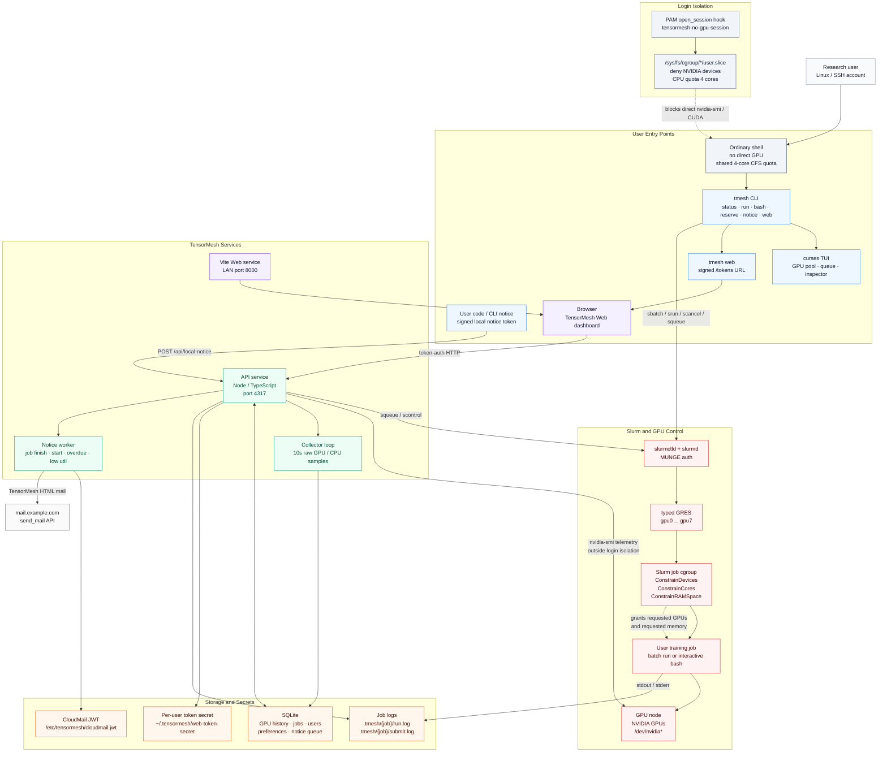

# TensorMesh Architecture

Runtime architecture for the current TensorMesh deployment: CLI/TUI, Web/API, Slurm, GPU isolation, history storage, logs, and mail notices.

```mermaid
flowchart TB
  %% TensorMesh runtime architecture
  classDef user fill:#f8fafc,stroke:#94a3b8,color:#0f172a,stroke-width:1px
  classDef cli fill:#eef6ff,stroke:#2f80ed,color:#0f172a,stroke-width:1px
  classDef web fill:#f4f0ff,stroke:#7c3aed,color:#111827,stroke-width:1px
  classDef api fill:#ecfdf5,stroke:#059669,color:#064e3b,stroke-width:1px
  classDef data fill:#fff7ed,stroke:#ea580c,color:#431407,stroke-width:1px
  classDef slurm fill:#fef2f2,stroke:#dc2626,color:#450a0a,stroke-width:1px
  classDef guard fill:#f1f5f9,stroke:#475569,color:#0f172a,stroke-width:1px
  classDef external fill:#fafafa,stroke:#737373,color:#171717,stroke-width:1px

  User["Research user<br/>Linux / SSH account"]:::user

  subgraph Entry["User Entry Points"]
    Shell["Ordinary shell<br/>no direct GPU<br/>shared 4-core CFS quota"]:::guard
    CLI["tmesh CLI<br/>status · run · bash · reserve · notice · web"]:::cli
    TUI["curses TUI<br/>GPU pool · queue · inspector"]:::cli
    WebLink["tmesh web<br/>signed /tokens URL"]:::cli
    CodeNotice["User code / CLI notice<br/>signed local notice token"]:::cli
    Browser["Browser<br/>TensorMesh Web dashboard"]:::web
  end

  subgraph Isolation["Login Isolation"]
    PAM["PAM open_session hook<br/>tensormesh-no-gpu-session"]:::guard
    UserSlice["/sys/fs/cgroup/*/user.slice<br/>deny NVIDIA devices<br/>CPU quota 4 cores"]:::guard
  end

  subgraph Service["TensorMesh Services"]
    WebSvc["Vite Web service<br/>LAN port 8000"]:::web
    API["API service<br/>Node / TypeScript<br/>port 4317"]:::api
    Collector["Collector loop<br/>10s raw GPU / CPU samples"]:::api
    NoticeWorker["Notice worker<br/>job finish · start · overdue · low util"]:::api
  end

  subgraph Slurm["Slurm and GPU Control"]
    SlurmCtl["slurmctld + slurmd<br/>MUNGE auth"]:::slurm
    GRES["typed GRES<br/>gpu0 ... gpu7"]:::slurm
    JobCgroup["Slurm job cgroup<br/>ConstrainDevices<br/>ConstrainCores<br/>ConstrainRAMSpace"]:::slurm
    Job["User training job<br/>batch run or interactive bash"]:::slurm
    GPU["GPU node<br/>NVIDIA GPUs<br/>/dev/nvidia*"]:::slurm
  end

  subgraph Store["Storage and Secrets"]
    SQLite["SQLite<br/>GPU history · jobs · users<br/>preferences · notice queue"]:::data
    Logs["Job logs<br/>.tmesh/{job}/run.log<br/>.tmesh/{job}/submit.log"]:::data
    TokenSecrets["Per-user token secret<br/>~/.tensormesh/web-token-secret"]:::data
    MailSecret["CloudMail JWT<br/>/etc/tensormesh/cloudmail.jwt"]:::data
  end

  MailAPI["mail.example.com<br/>send_mail API"]:::external

  User --> Shell --> CLI
  CLI --> TUI
  CLI --> WebLink --> Browser
  WebSvc --> Browser
  Browser -- "token-auth HTTP" --> API
  CodeNotice -- "POST /api/local-notice" --> API

  PAM --> UserSlice
  UserSlice -. "blocks direct nvidia-smi / CUDA" .-> Shell

  CLI -- "sbatch / srun / scancel / squeue" --> SlurmCtl
  API -- "squeue / scontrol" --> SlurmCtl
  API -- "nvidia-smi telemetry<br/>outside login isolation" --> GPU

  SlurmCtl --> GRES --> JobCgroup --> Job --> GPU
  JobCgroup -. "grants requested GPUs<br/>and requested memory" .-> Job

  API --> Collector --> SQLite
  API <--> SQLite
  API --> TokenSecrets
  Job -- "stdout / stderr" --> Logs
  API --> Logs
  API --> NoticeWorker
  NoticeWorker --> MailSecret
  NoticeWorker -- "TensorMesh HTML mail" --> MailAPI
```
